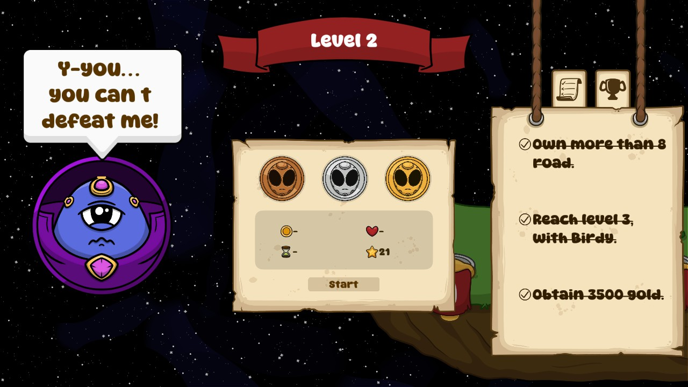
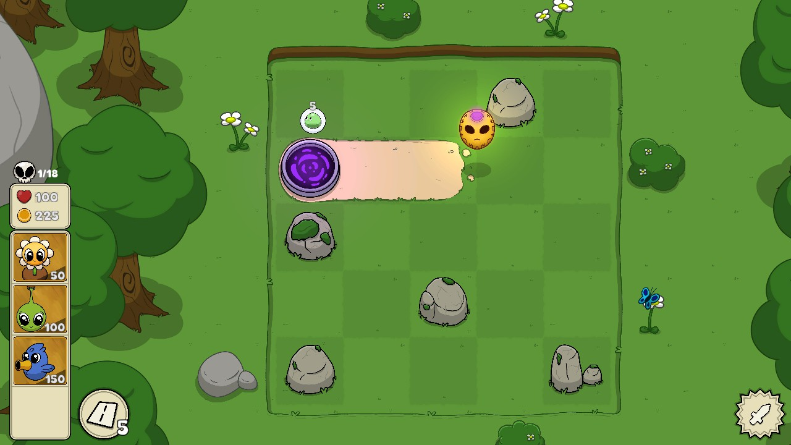
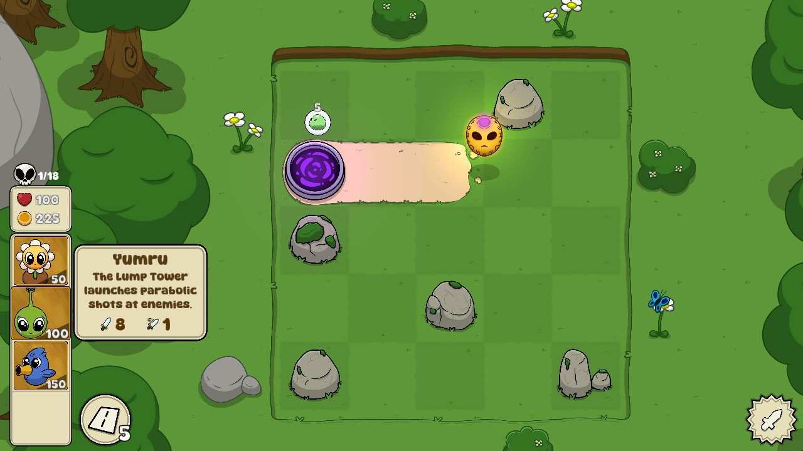
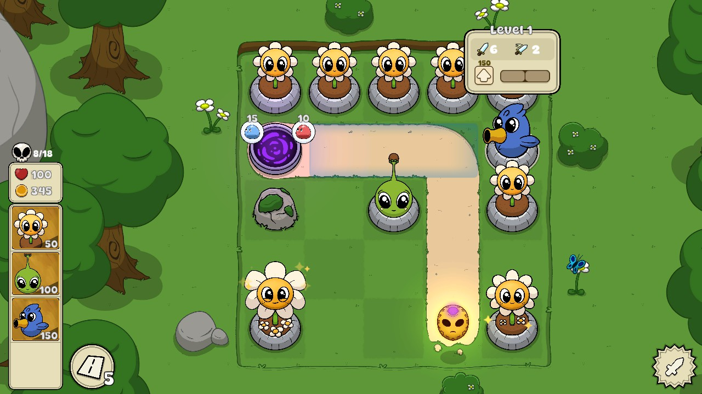
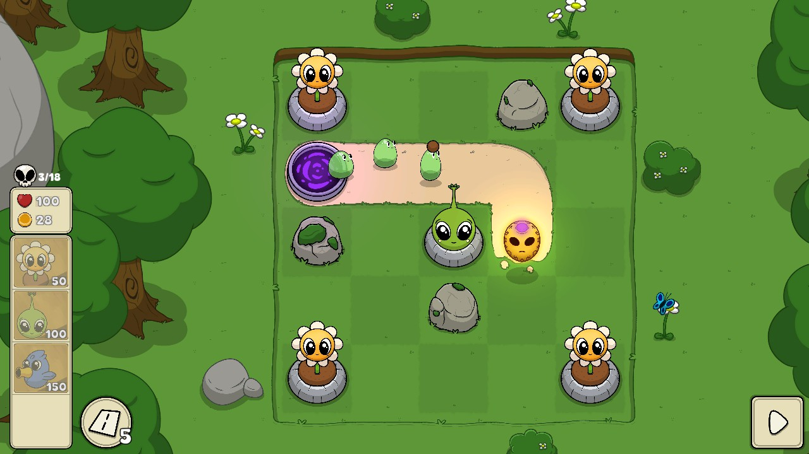
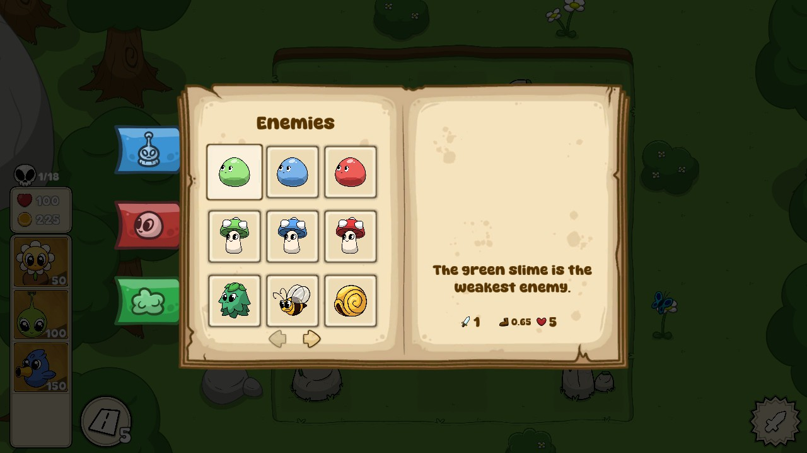

# Evolit

## Overview

Evolit is a tower defense game where enemies are coming for you, an alien escapee. Choose and build your defenses so they can't take you back!

## Gameplay

You've escaped a brutal alien leader who is trying to kill you! Make sure he can't capture or kill you!

The tutorial is extremely minimal here, so hopefully this gameplay explanation helps.

You will discover towers and enemies as you progress. Place towers strategically to defend against enemies. If the enemies touch you, you will lose health. When your health gets to 0, it's game over.

As is traditional in these types of games, the Sunflowers will give you gold at the start of each wave. You can spend gold to place towers. Each tower has a cost (which is what is displayed by default - could definitely use an icon to help with understanding), an attack value, and a timing value. The attack value is how much damage it deals, if it deals any damage. The timing value is how fast it has an effect (like how fast it attacks or how much it slows down enemies). These are visible in the tooltip.

You can upgrade towers to make them more powerful. This is never explained in the tutorial, but it is essential.

One interesting twist in this game is that you have to build the path that enemies take. This costs gold as well. Make them weave and wind their way around your defenses to give your towers the most chances to stop them.

You can build new towers during the combat phase, but you cannot upgrade towers or remove rocks at this time. You can never remove towers, which is punishing. You might have to play counter-intuitively in order to get past the early levels. It's not friendly to casual players. It seems to be much more targeted at seasoned tower defense players.

There is also a wiki, which is indispensible! Took me a while to find it (Pause menu -> Wiki).

Learn how to best use the different towers to defend yourself! If you survive all of the waves on the level, you clear it and move onto the next level. Depending on how you played, you might get some medals.

## Favorite Parts

- The tower and enemy designs are cute!
- There's a wiki detailing all the enemies and towers you've discovered so far.
- Lots of easter eggs!

## Areas for Improvement

- The game is brutally difficult. I had to watch a Turkish(?) streamer just to understand how to play the game "properly" so I could get past the early levels.
- You cannot remove towers once they are placed, aside from the "undo" for the same turn.
- The tutorial is a new take on the word "minimal".

## Target Audience

While this looks quite inviting, it's really meant for hardcore gamers. The placements need to be perfect. Casual gamers will likely get very frustrated, probably around the second level.

Anyone who enjoys DIFFICULT tower defense games will like this one!

## Summary

If you're a hardcore fan of tower defense, this game is for you! If you think it will be a cute, simple game like Plants vs. Zombies, stay away from this one.

## Store Link

[Evolit on Steam](https://store.steampowered.com/app/2547320/Evolit/)
