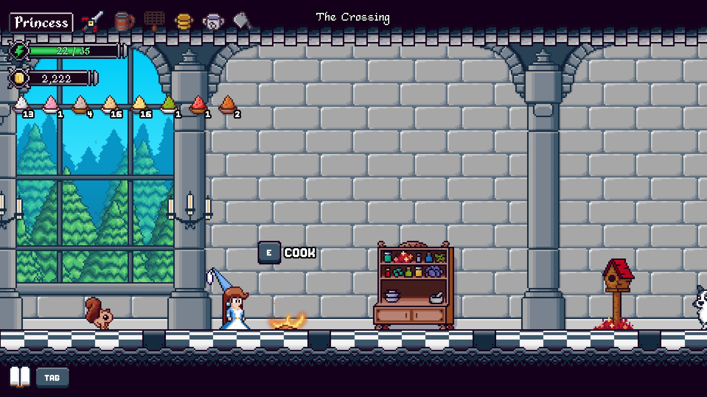
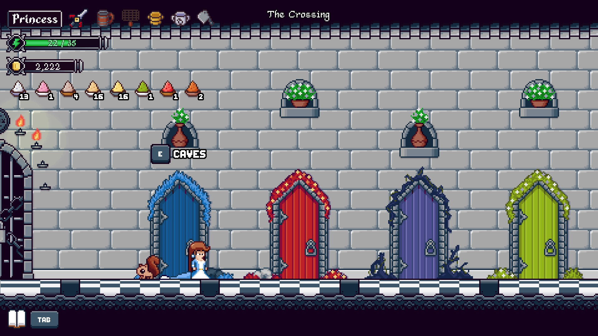
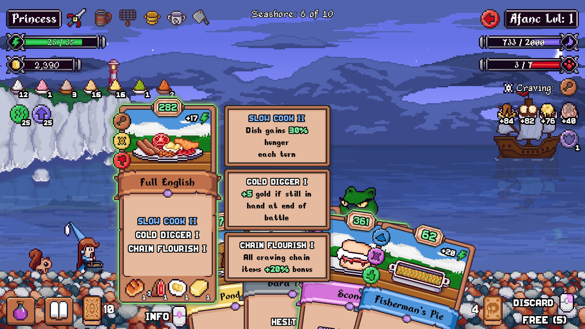
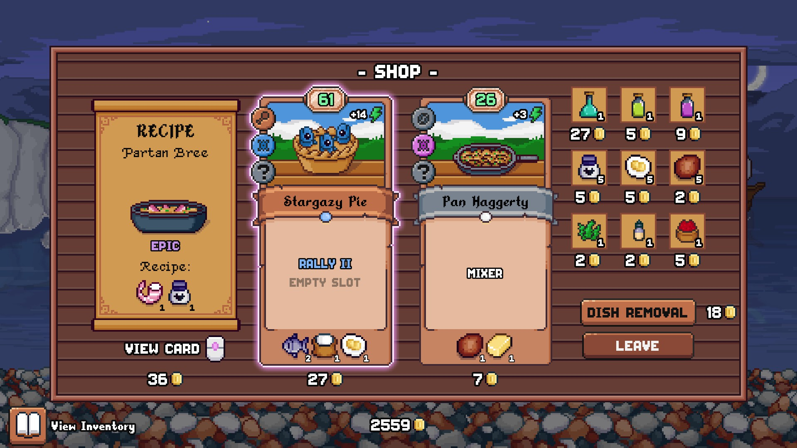
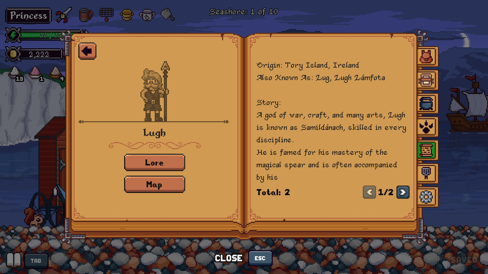

# Hungry Horrors

## Overview

Hungry Horrors is a roguelite where instead of fighting monsters, you feed them! No killing necessary here. Just give them enough food to eat, and they'll leave you alone. Just hope that they like your cooking!

## Gameplay

You are the princess. You are waiting for your prince. Of course, things don't go according to plan. You have to learn to cook in order to appease monsters invading your kingdom.

In the castle, you can cook dishes you have learned to create your starting deck. You can also season dishes, set a starting artefact, change familiars, and change your appearance here once you've unlocked these abilities.

Then you choose a door. Which area will you explore and feed its monsters?

Inside the door, you will find many monsters. You must feed them based on their food preferences. Beware an angry monster who **HATES** your dish! You can also "cycle" (discard and draw) some number of free times, and then at the cost of your stamina. Monsters will attack you or move forward. Their attacks do various things, often reducing your stamina. Don't let your stamina drop to 0, or it's a gruesome yet still cute death scene. If they reach you, well, enjoy the death scene.

Your goal is to satiate their hunger before they reach you (or otherwise kill you). Each dish will have a hunger value. But the real key is the cravings chain! Feed them what they want to eat each turn, and you'll get a bonus for each dish you served them earlier in the fight. Pay attention to their craving, and their likes and dislikes.

You can buy helpful items and new recipes at the shop!

You can also read about the lore.

The game is in early access and isn't finished yet, so who knows what awaits you?

## Favorite Parts

- The lore is wonderful. You can read all about the monsters and events.
- The death scenes. Let's just leave it at that.
- The attitude of the princess. Enjoy the dialogue and the "bored" animations!

## Areas for Improvement

- It's early access, so all of the content isn't available yet. I'm sure time will resolve this!

## Target Audience

Casual gamers will enjoy this, as it gets easier the more you play it and unlock things. The fights are not unbeatable, though you may have to use some consumable items.

Hardcore gamers will find this a bit too light and fluffy. They may still enjoy the lore!

## Summary

If you enjoy British and Irish folklore, or food, get this game! It's a cute non-violent roguelite. And if you still need another reason to get this, you can pet the cat, dog, and your familiar.

## Store Link

[Hungry Horrors on Steam](https://store.steampowered.com/app/3048840/Hungry_Horrors/)
