# Isle of Swaps

## Overview

Isle of Swaps is a roguelite TCG (trading card game) where you battle other kids your age on the playground, trading cards with them if you win. It's inspired by the Pokemon TCG, and evokes memories of a simpler time in our lives. :angel:

## Gameplay

There are multiple characters you can play as, each with a unique ability. Everyone's a kid on the school playground, obsessed with Critters, the newest collectible card game! You have a binder and some starter cards. Challenge your peers and trade cards with them.

### Challenge Run

First, you pick your character and any modifiers you'd like. Each character has a special ability.

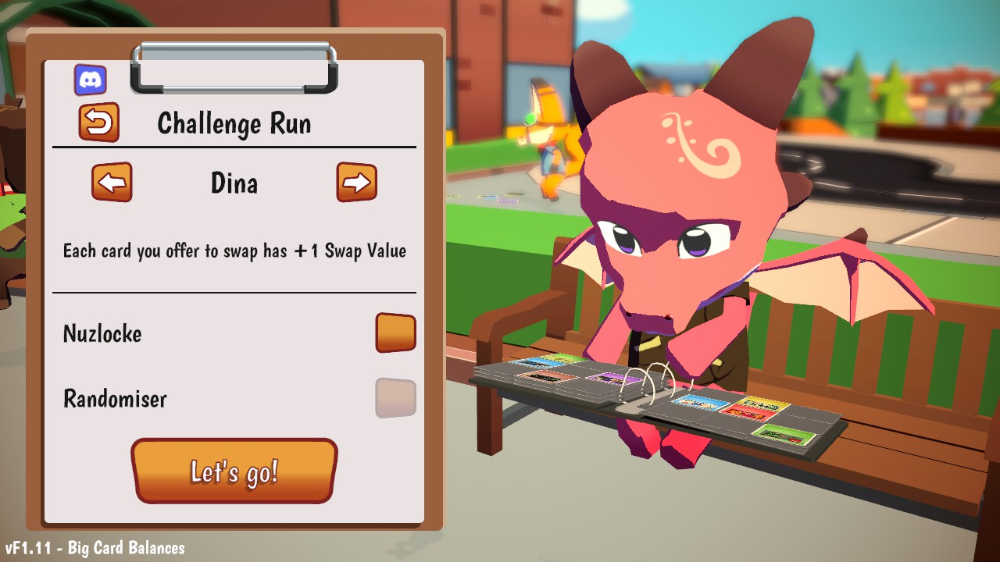

Choose a starter. You'll get a basic deck along with it. Critters have attack and defense values. They attack with their attack value, and reduce incoming damage by their defense value. Pay attention to the type advantages and disadvantages! They'll make certain attacks critical, or not very effective, just like in Pokemon. Those are listed at the bottom of the Critter cards.

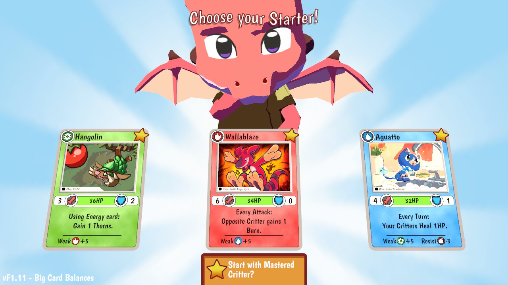

You'll have a series of encounters across 3 different "zones".

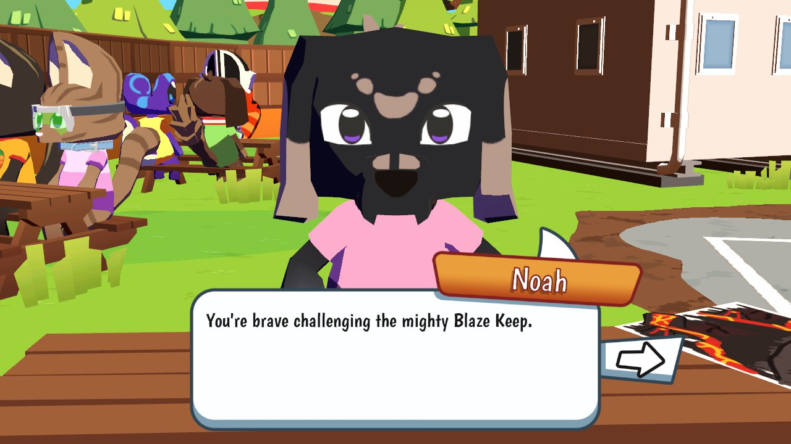

Each encounter will give you a choice. You can battle a "wild" Critter to capture it, fight a fellow Critter player in order to trade with them, visit a shop, encounter a trader, or perhaps face off against Team Rockoon. You'll need to win your battles in order to have a deck and group of Critters strong enough to win the final battle!

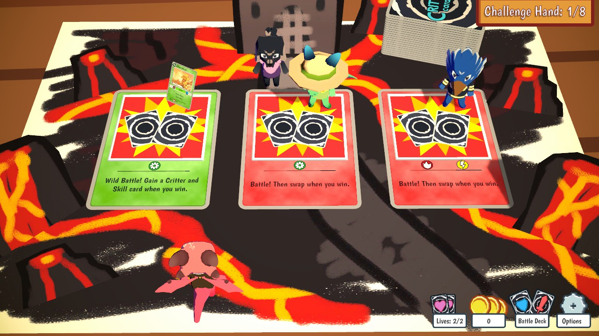

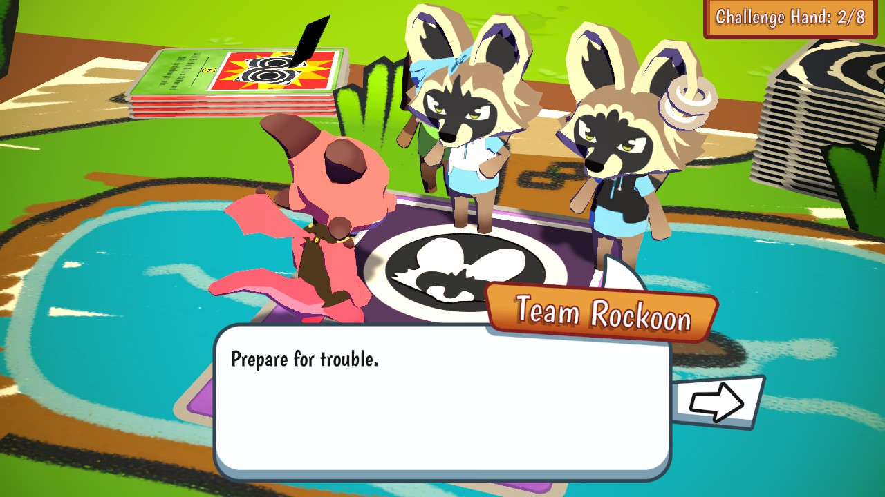

Each turn, you can play a certain number of cards (as indicated in the bottom left, default 3). Cards might attack your opponent, or they might give you energy to unleash more powerful attacks in the future. The energy counter is at the top of the screen. It's a little weird at first, but you have to drag the cards you want to play onto your Critter in order to play them. You can see what your opponent is going to do based on the cards to the right of their Critters.

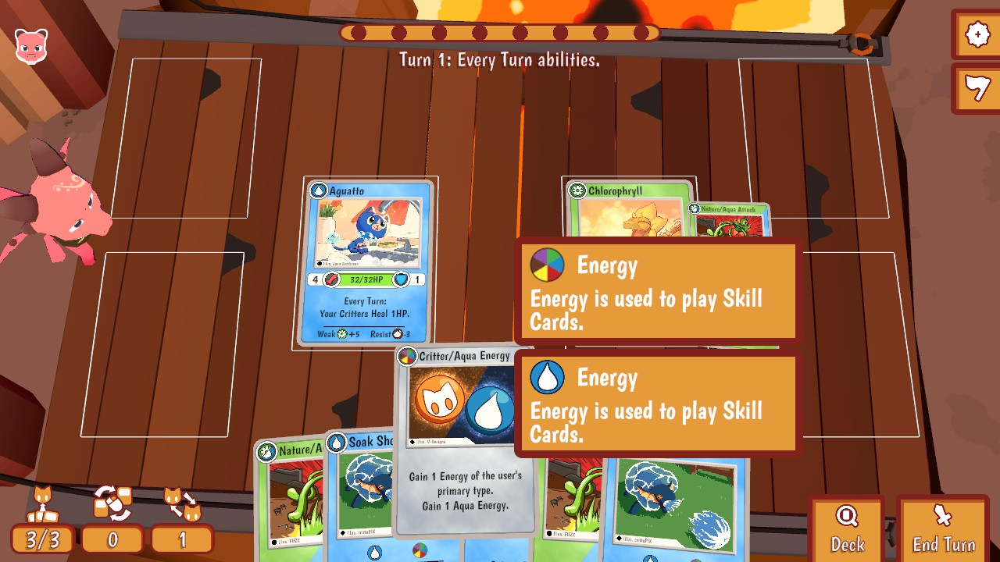

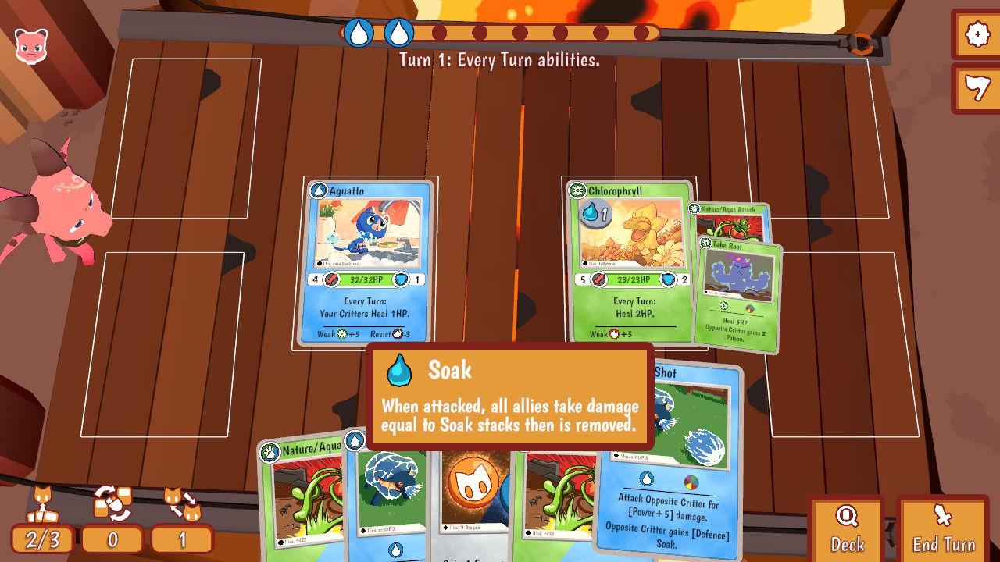

You can also "swap" (move) your Critter to another one of the 3 spots on the board, which determines who it attacks in battles with multiple Critters. If you don't like the cards in your hand, you can "swap" them (cycle - discard and draw) a certain number of times, also indicated in the bottom left.

At the end of each turn, you'll discard any remaining cards in your hand. Don't worry, you'll draw a new hand next turn. Then your opponent plays, and it's back to you!

You can edit your deck once you pick up some more cards. For each Critter you have on your team, you'll have to add a few skill cards to your deck. Open the binder, flip through the pages or use the filters, and make your deck even stronger! You can have up to 3 Critters active at a time, but you can collect more and edit your deck based on your next opponent.

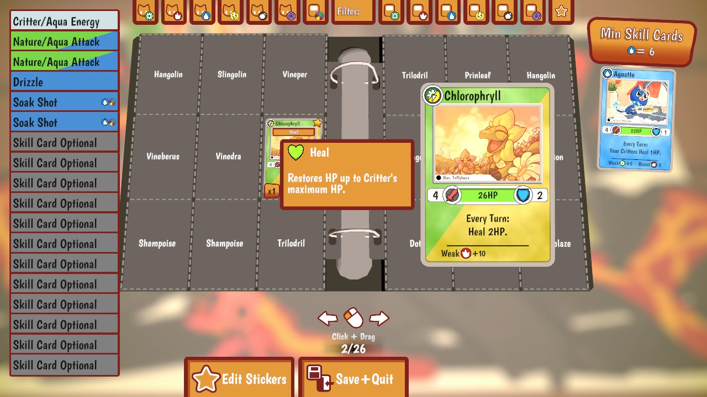

Swapping (trading) happens when you defeat an enemy player. They'll offer a set of cards available for trade, and you choose which ones you want, up to 5 at a time. Each card is valued based on its rarity. The rarer the card, the more "expensive" it is to trade for it. You can combine up to 5 of your cards to match the value, and then you swap cards!

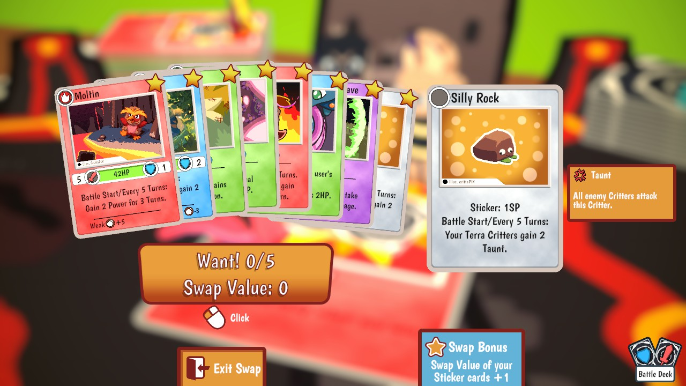

There are stickers which allow you to gain abilities to help with your runs. These are equipped from the deck editing screen.

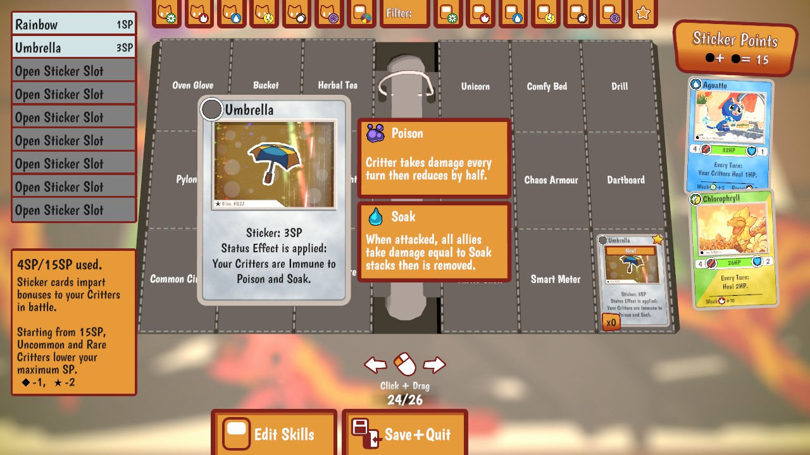

As you finish runs, you'll be able to add cards to your master binder. This is very confusing at first, but it just means that you can use that card in the Critter Championship.

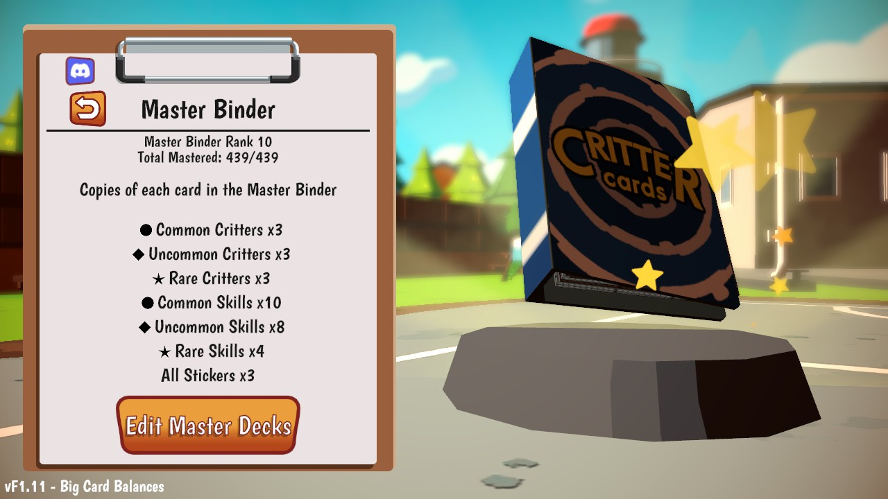

### Critter Championship

There's also another mode called "Critter Championship" which is more like a boss rush. Good for when you've collected a bunch of cards in your binder and can build a static deck going into the championship, as opposed to building your deck over the course of a run.

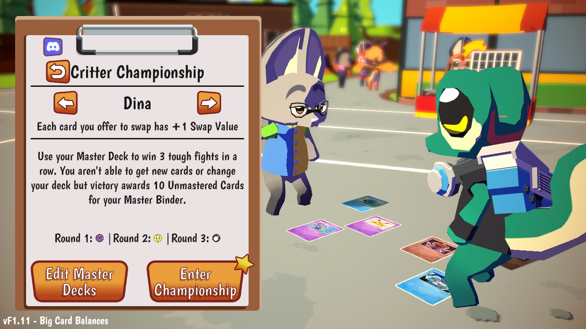

## Favorite Parts

- Team Rockoon. Enough said.
- The game has a great sense of humor, especially with the Critter names.
- It is nostalgic, and has a feeling of really being in elementary school again.
- The music is totally a riff on Pokemon battle music and I love it.

## Areas for Improvement

- There's a learning curve - it will take you a few playthroughs to understand.

## Target Audience

Casual gamers will love this, especially those who grew up with the Pokemon TCG. Everything is very cute and G-rated.

Hardcore gamers will find this is all fluff and no challenge at first, but then they will realize there are Randomizer and Nuzlocke modes because they love that stuff.

## Summary

If you're a fan of the Pokemon TCG, or other collectible card games like Magic, this is for you! And there is no need to reorganize your binder after you get new cards - it does that for you!

## Store Link

[Isle of Swaps on Steam](https://store.steampowered.com/app/2294160/Isle_of_Swaps/)
