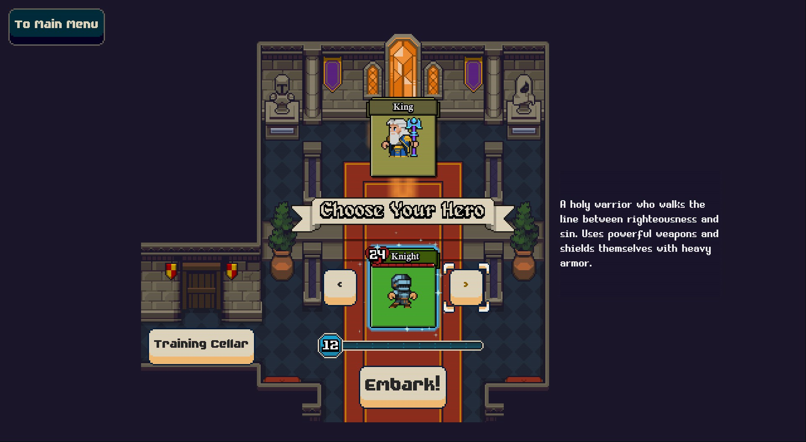
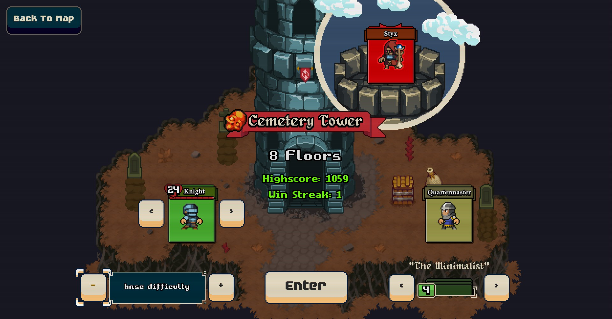
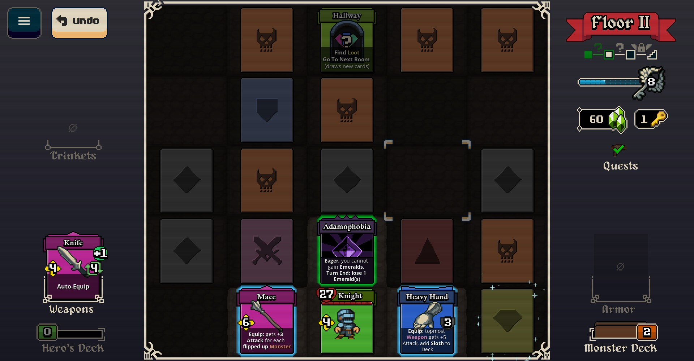
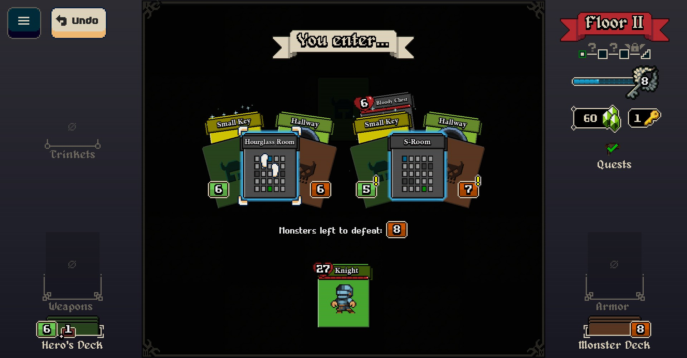
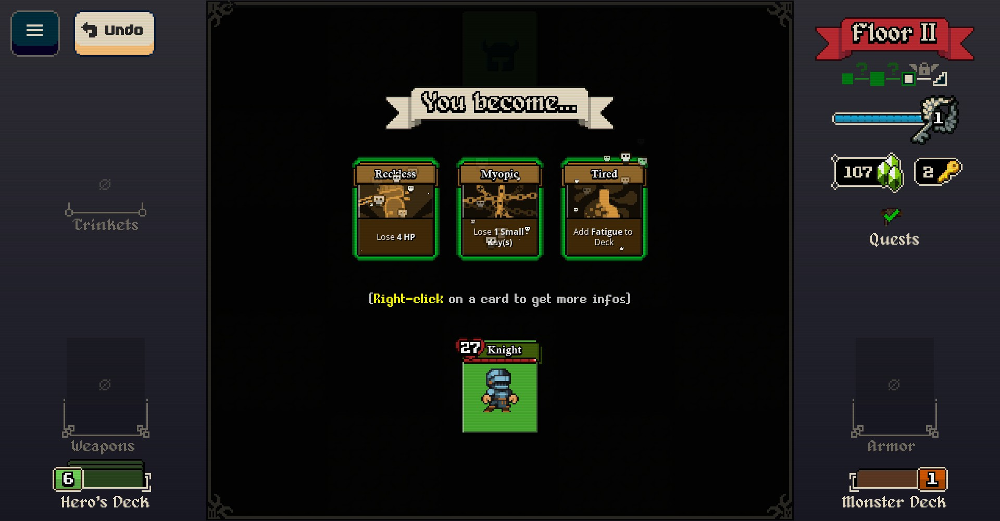
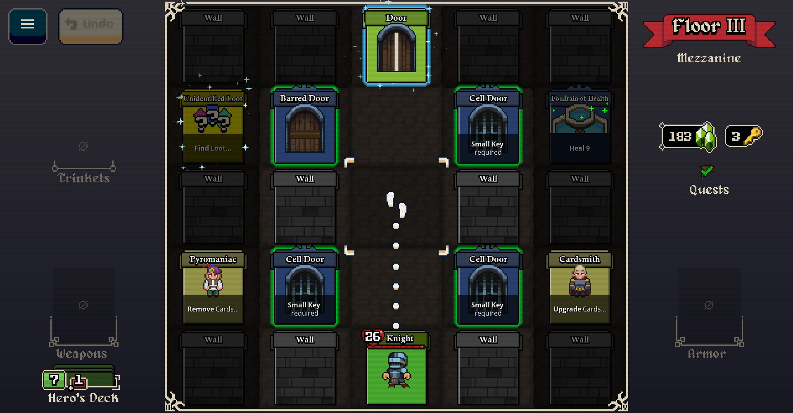

# Lost For Swords

## Overview

Lost for Swords is a dungeon crawler where you move around a grid collecting weapons, casting spells, and fighting monsters all by just moving. Plan your moves carefully, and see if you can defeat the entire tower!

## Gameplay

There is minimal story here. You have to climb to the top of multiple towers in order to defeat evil bosses that have turned your king to stone!

Each of the 4 characters plays differently. Choose your character and your starting deck, then choose a tower to climb.

You'll usually start with a weak weapon equipped. Pick up weapons and spells, but beware that they have limited uses! You can move freely around the room, but any action you take (clearing a card or attacking) will cause enemies to move and/or attack you! Any enemies that are undefeated when you leave the room go back into the deck, which must be cleared if you want to get to the next floor. If you run out of ways to damage your enemies, get out of there!

Each "floor" is composed of multiple rooms. At the end of a room there is either a hallway (to the next room) or a staircase (to the next floor). The room consists of various cards from a combination of the enemy deck and your deck. You can only see the cards around you (with nothing blocking reaching it). Clear cards to flip over more cards, and eventually find your way through the rooms and up the tower. Pick up weapons and spells, and use them wisely in order to defeat the monsters on the floor. Of course, if you need more time, you can always backtrack, but that will incur a penalty that gets harsher each time you do it.

Collect emeralds to spend at merchants. You'll need their services! Collect small keys to unlock merchants or other bonuses.

Can you get to the top and defeat the boss?

## Favorite Parts

- Each hero plays differently, and it's fun to discover their strategies.
- Finally clearing a tower is such a sense of accomplishment!
- Having everything "click" and building powerful synergies is rewarding.

## Areas for Improvement

- There's basically no story. The characters all seem very generic. But that's ok as long as you didn't buy the game expecting story and character development.
- There are some bugs related to the Warlock character but nothing major.

## Target Audience

Casual gamers will enjoy the relative simplicity of the gameplay. It's difficult, of course, but not insurmountable. Once you get to know the strategies for the characters and the attack patterns of the enemies, it gets a lot easier.

Hardcore gamers will likely find this too easy or simple.

## Summary

If you enjoy thinking about your moves and planning out your dungeon clearing strategy, you'll get a kick (yes, pun intended - defeat a boss to find out!) out of this game. The rules are simple, while the strategy is more complex.

## Store Link

[Lost For Swords on Steam](https://store.steampowered.com/app/2638050/Lost_For_Swords/)
