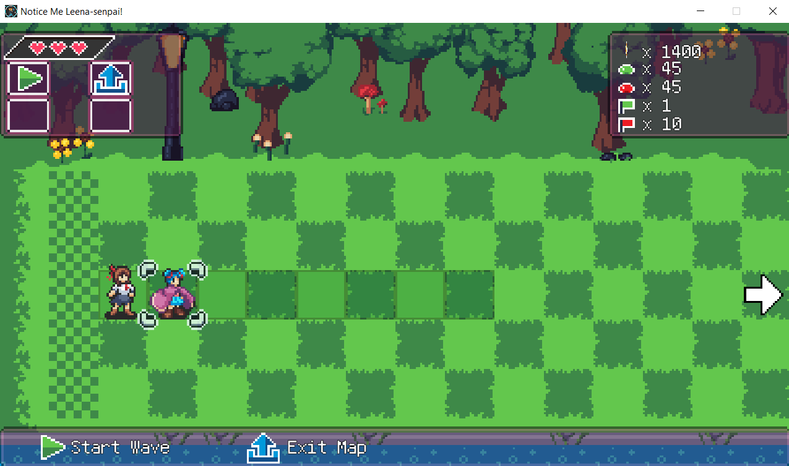
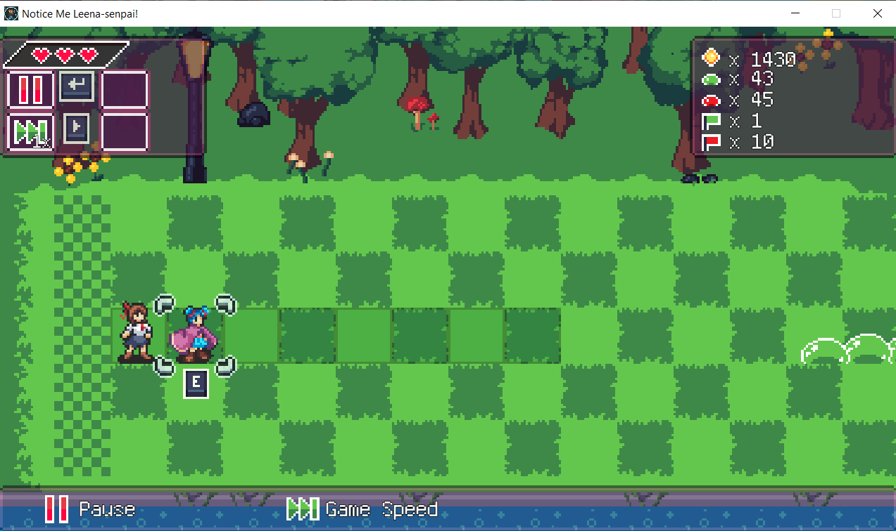
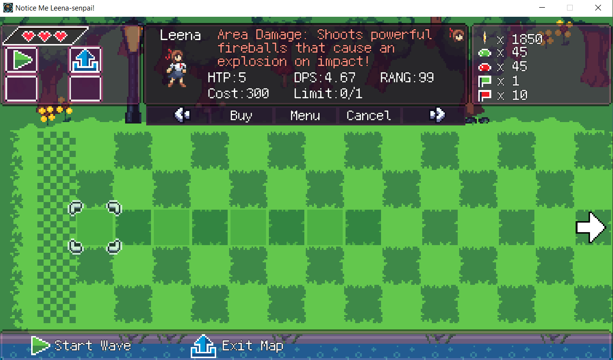
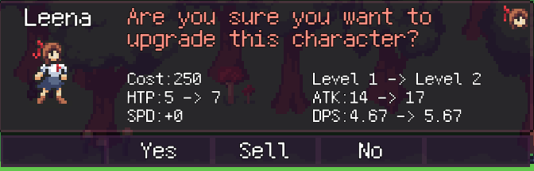
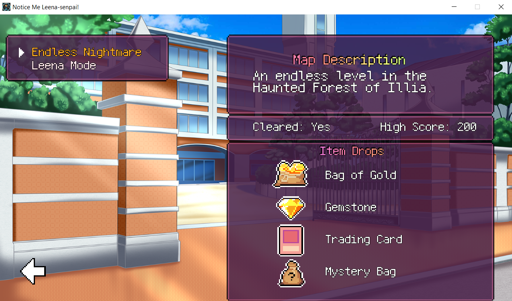
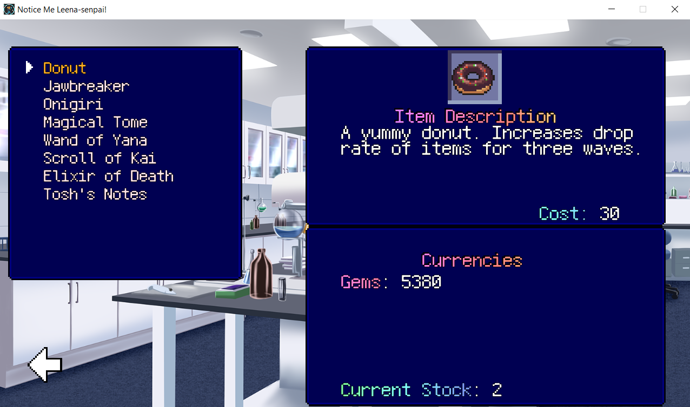
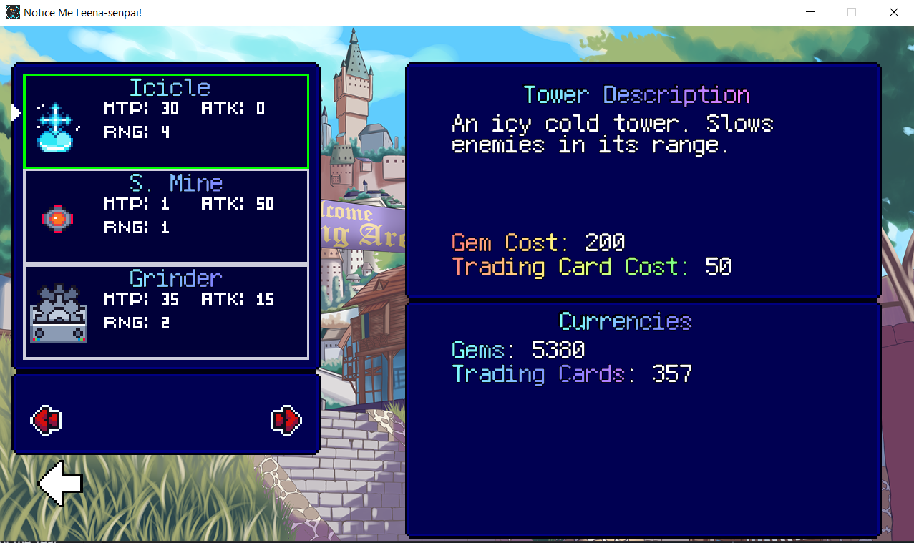

# Notice Me Leena Senpai!

## Overview

Notice Me Leena Senpai! is a tower defense game with cute anime girls. You're the star student (and upperclassman - senpai) at an all-girls Magic Academy when the school gets attacked! Gather your friends to fight off the monsters, and find out who is behind the invasion and why.

I found this game by joining the Discord server for [Dokimon](https://store.steampowered.com/app/2019300/Dokimon_Quest/). It mostly flew under the radar, but it's definitely worthwhile!

## Gameplay

Part of the game is visual novel, and the other part is a grid-based tower defense.

The visual novel tells the story of the magic academy getting attacked, and the students working together to find out the reason for it. (Apparently I can't revisit the story parts, only their levels. Otherwise I'd take a screenshot.)

The tower defense aspect is the main part of the game. When playing the story mode, after each bit of story, you'll have to defeat a level with multiple waves of enemies. Grid shading shows which squares you can place units (girls) on. This area will likely expand during the level, so plan accordingly. The enemies come from the right side and move with varying speeds. You place your units on the left side to defend. If any enemies get to the left-most column, you lose a heart. If you lose 3 hearts, you fail the mission. Don't worry, you can always retry!

Each unit has different stats like how much damage it deals, how fast it attacks, its range, and how many you can have on your grid at a time. Place your long range units towards the left side, and the shorter range units closer to the enemies.

You can level up your units as much as you want, provided you have the money to do so. Each time you level them up, they become more expensive to level up. Leveling up also fully heals them, so plan accordingly.

There is also a survival mode, which has no story, and takes a lot of time. There are 200 waves in the first survival mode, and it can take multiple hours to complete, if you get that far. There is another survival mode that is meant to be impossible, according to the developer, with 400 waves. I don't want to imagine the amount of time, but thankfully you die pretty quickly in that one!

There are also stores where you can buy items and unlock characters for survival mode. You can spend gems or trading cards here, which are items you collect while playing.

Help Leena save the food!

## Favorite Parts

- The story is silly and the characters are cute. It's very G-rated.
- There is a lot of depth to the tower defense strategy, especially with the unique characters.
- There's so much food to save! The story is much longer than I expected.
- You can remove units and get a half-refund. Thank you!

## Areas for Improvement

- It's actually pretty difficult until you master the strategy. You need to know that the unique characters are super-effective against bosses.
- It is visually and auditorily overwhelming at times. Visual effects and sound effects can be distracting. "Busy" is a good way to describe it (and an understatement).
- Portals are unintuitive. You have to link them, and it doesn't warn you if you start a wave with unlinked portals.
- Upgrading units doesn't count as "spending" gold for the achievement.

## Target Audience

Casual gamers will love this! It's fun and silly. It does get difficult, so remember to use the unique characters as you unlock them, and protect your healers!

Hardcore gamers might enjoy the endless mode here, but they'd have to get through the story and all its cuteness first!

## Summary

If you enjoy a non-punishing tower defense game, you'll like this. The art is also great for those who simply like the anime style.

## Store Link

[Notice Me Leena Senpai! on Steam](https://store.steampowered.com/app/1988530/Notice_Me_Leenasenpai/)
