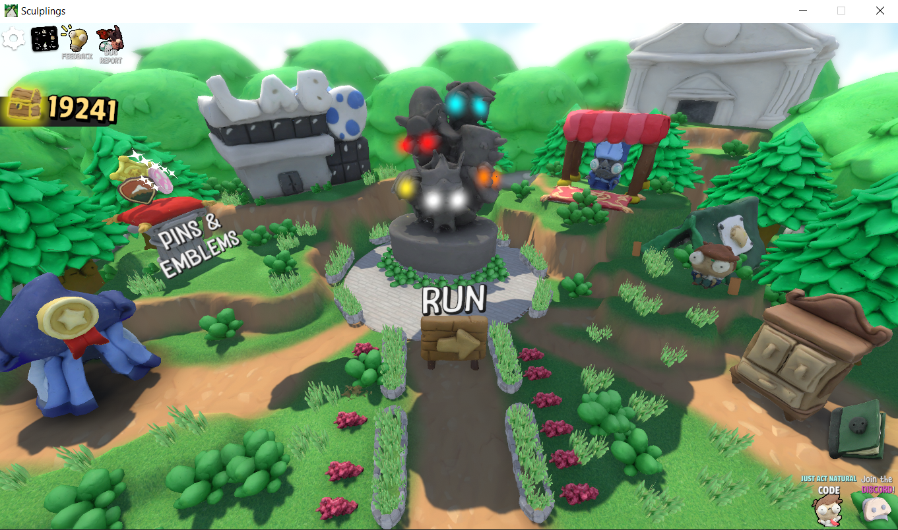
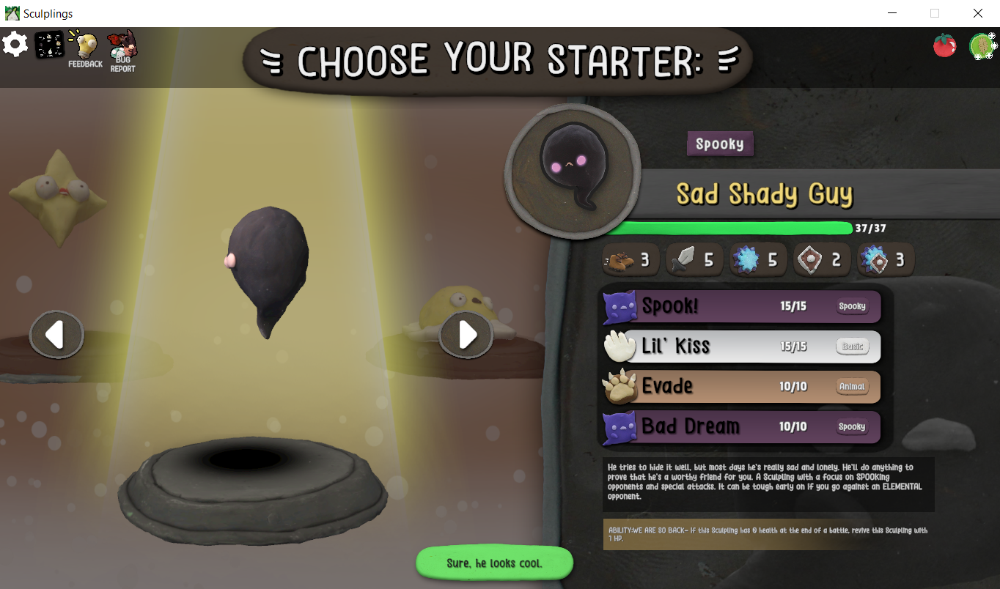
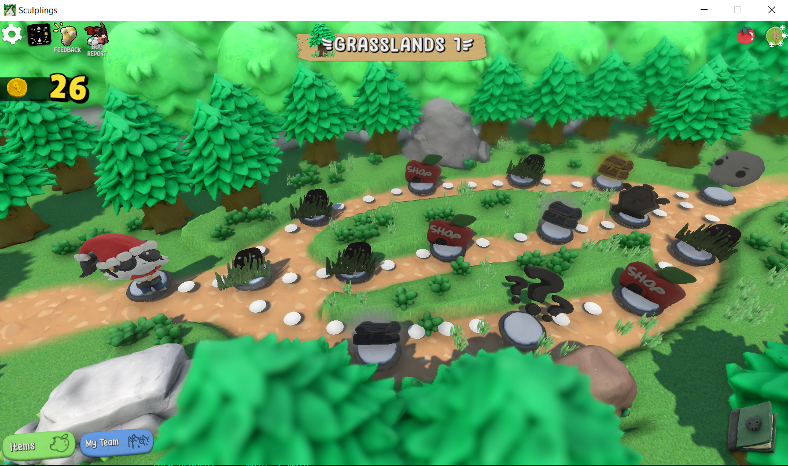
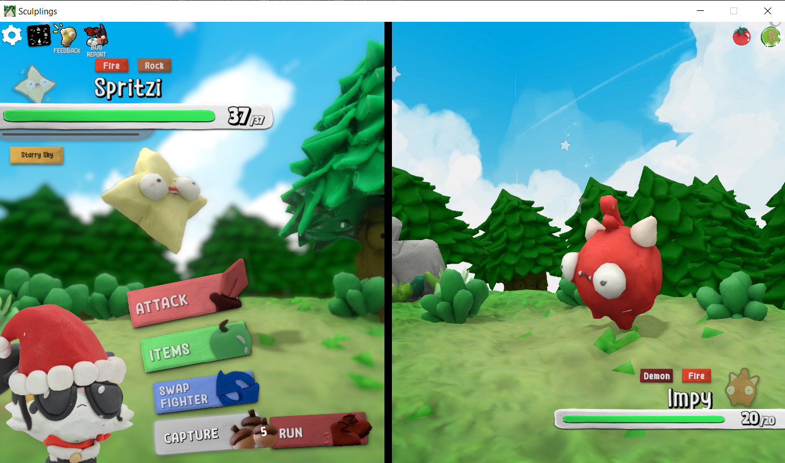
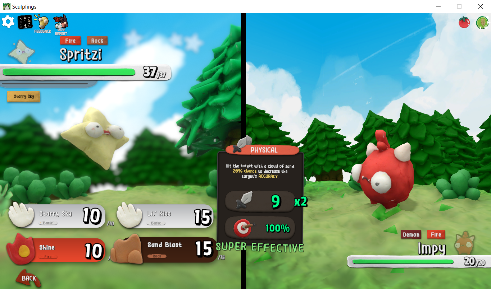

# Sculplings

## Overview

Sculplings is a cross between a roguelite and a creature collector. Think "Pokemon Slay the Spire". The scenery, the creatures, and the characters are all hand crafted out of clay!

## Gameplay

You start out at your home base, where you can do a variety of things once you've gone through the game a few times.

Start a new run by clicking on the sign with the arrow on it.

You get to choose your starting sculpling. These are randomized from a pool of starters. Be sure to read all the descriptions carefully! You can choose to nickname your starter, but they're pretty good already.

You'll start in the Grasslands. Here you'll see a map with various nodes. There are monster encounters, shops, random events, treasure chests, pin chests, healing spots, and an area boss. Choose a path and go!

In combat, you send out the sculpling in your party that you've marked as your starter. You can choose to fight, use an item, change your sculpling, capture the enemy, or flee. Sculplings are easier to catch when they're low on health, so try fighting one and then capturing it. You start with 5 acorns (capture items), and you can have a team of up to 4 sculplings.

You can have up to four attacks per sculpling. They'll even show you if they're super effective or not! How convenient!

If you make it through the two grassland areas, you'll get to choose another area to explore. After 3 areas, you'll reach the arena. What awaits you there? Play to find out! :crown:

## Favorite Parts

- The humor is amazing. Read all the descriptions. All the sculpling names. All the move names. All the event text. All the button text. All the dialogue. Feel free to literally laugh out loud.
- The art shows how much love was put into this game. It's unique. It's adorable. It's beautiful.
- The core gameplay loop is quite fun on its own. The pace is good.

## Areas for Improvement

- It would be nice to be able to capture a couple of Sculplings that appear in the game as enemies only, although I hear this might be coming!
- It would be nice if the resolution setting persisted when opening the settings menu.

## Target Audience

Casual gamers will LOVE this game! The later bosses get very difficult, so more hardcore gamers can enjoy that.

If you liked Pokemon but wish you could play through it in about an hour, you'll love this game!

If you liked Slay the Spire but thought it was too difficult, you'll love this game!

## Summary

BUY THIS GAME!!! IT'S SO MUCH FUN!!

## Store Link

[Sculplings on Steam](https://store.steampowered.com/app/3062680/Sculplings/)
