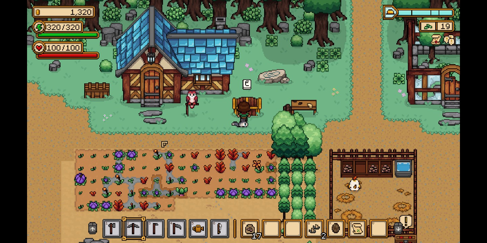
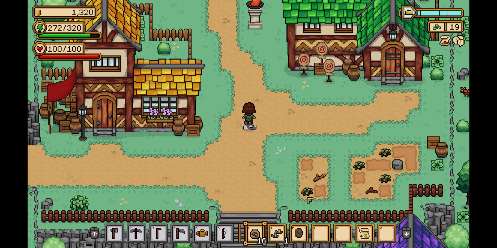
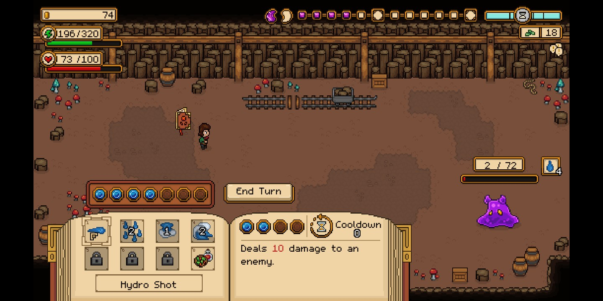
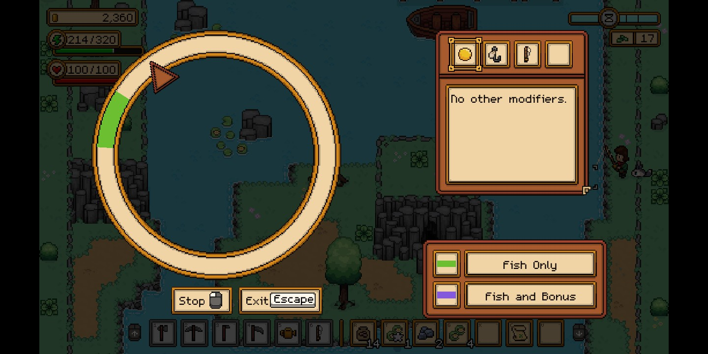

# Seeds of Calamity

## Overview

Seeds of Calamity is Stardew Valley without being overwhelming. It's a farming simulator with collecting and combat. Some aspects of Stardew Valley are improved to not be frustrating (yay!) and others are simplified.

## Gameplay

After customizing your character, spellbook companion, and choosing a starting map, you become the new farmer in the town. The Adventurer's Guild has assigned you to this role to help support the nearby city in rebuilding after a major war. So you take over an abandoned farm, clean it up, start growing crops, and raising animals.

You will meet the various townsfolk and help them out with their questlines, which are well spaced out over the first year in game time. There's no need to give gifts or make people "like" you. You aren't forced to romance anyone (and actually you can't!). There's one romance plotline and it doesn't involve you. These are good differences from Stardew Valley.

Your chosen spellbook companion will aid you in dungeon diving, where you cast spells on monsters and try to make it through the floor of the dungeon. It's a turn-based fight, which is also nice for those of us who don't enjoy real time combat (and kind of suck at it). There's a lot of loot in the dungeons that you can sell for :moneybag: :moneybag: :moneybag:.

Fishing is greatly simplified and has quality of life improvements. You don't need to attach bait :pray:, and the modifiers are shown. It's a little confusing at first as there's no indication of how to start the reeling minigame (it's the left mouse button), but after that it makes a lot of sense.

## Favorite Parts

- No need to constantly look things up on a wiki! (That really frustrated me about Stardew Valley.)
- The character stories are really cute. One of the last quests is legitimately hillarious.
- Much much much simpler than Stardew Valley.

## Areas for Improvement

- Artifact hunting is not fun. You search for an entire month and keep getting the same artifact you've already found instead of the one common one you haven't.
- The achievement "energetic" does not trigger as of v1.0.1.
- There's no weather guarantee. I went through an entire winter without a windy day. Having to play another full year in game just to get a chance at a windy winter day is not a great experience.

## Target Audience

This is absolutely intended for casual gamers who actually want a relaxing game. You can pick it up and put it down whenever you want, although it might be hard to put down!

## Summary

If you loved Stardew Valley but found it too complicated, this game is for you!

## Store Link

[Seeds of Calamity on Steam](https://store.steampowered.com/app/1780070/Seeds_of_Calamity/)
