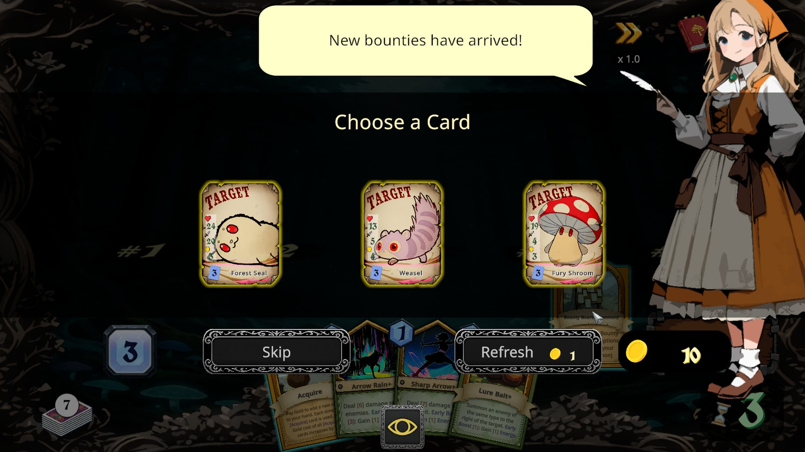
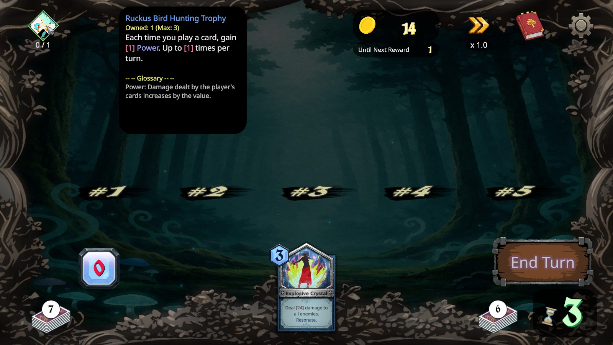
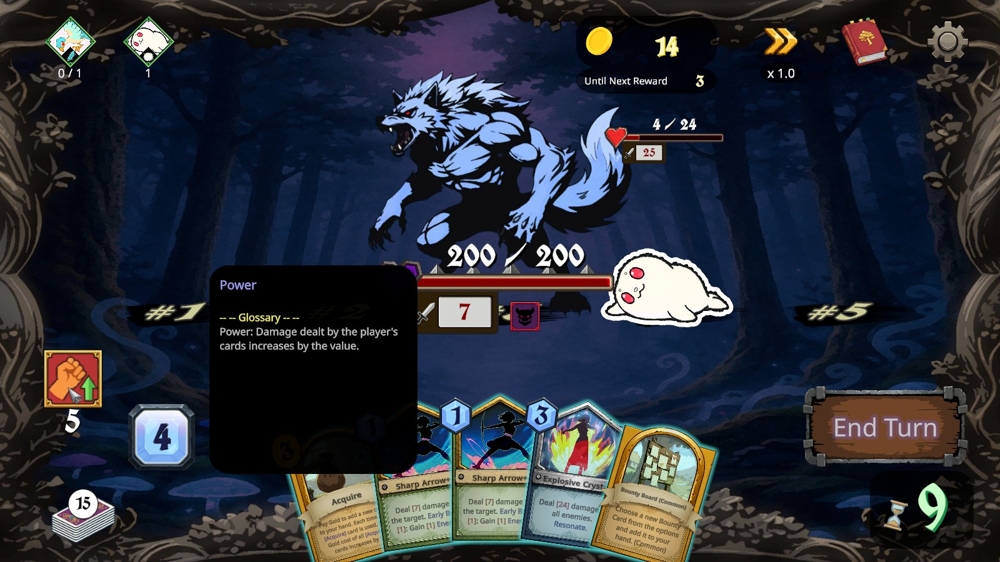
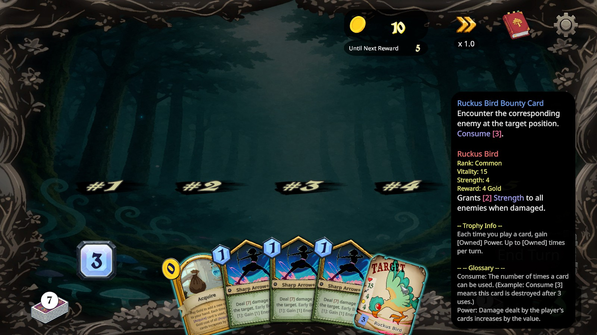
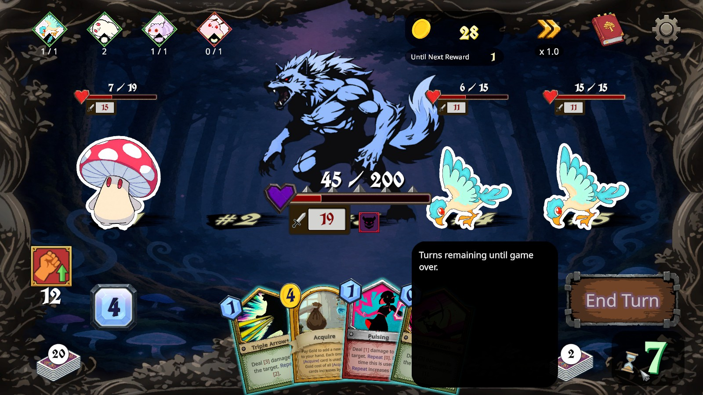
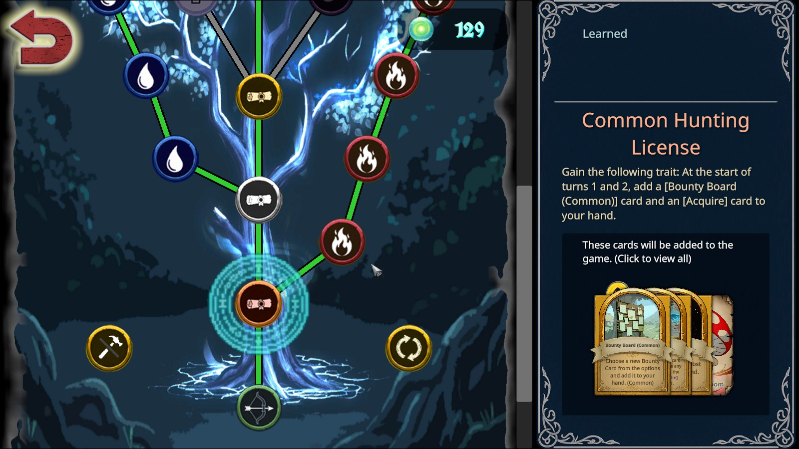

# Shuffle Hunt

## Overview

Shuffle Hunt is a roguelite where you play as a hunter. You've been hired by the local townsfolk to figure out the source of corruption in the forest, which is making the animals violent. Along the way, you'll also discover the mystery of your past.

## Gameplay

In Shuffle Hunt, you play as a half-elf hunter facing off against the corrupted animals of the forest. You need to figure out what's going on, and how to restore peace to the woodlands. As you progress through the chapters, you'll unlock some of the story along with it.

Use bounty boards and acquire cards to add monsters and cards to your deck.

Fight the various monsters that you summon from your hand in order to gain trophies. These trophies make you stronger by giving you abilities that last the entire run. You will need a lot of them in order to defeat the final boss, which is your bounty. In other words, power up, then get ready for a real fight!

Gain coins from defeating monsters, and spend them on acquiring cards. You start with 3 energy each turn, so plan your plays accordingly. You start with 0 power, and you'll need to gain a lot of it in order to defeat the boss. You can gain more energy and power from trophies and cards. At the end of your turn, discard your hand, then draw a new one. You only have a certain amount of turns before the boss, so make them count!

Each monster has abilties that happen when it is summoned, when it is their turn, as well as the trophy abilities that you gain when you defeat the monster. There's a lot of information, which leads to a learning curve (or a wall of text), but this gets better as you learn the monsters.

The monsters will attack each other, which is critical to figuring out which monsters to kill and which to leave alone. You can only buff the monsters - you cannot target yourself. This is strange at first, but once you realize it's sometimes beneficial to leave the monsters alone and let them fight each other, it makes more sense. There are times when you see a card and wonder why you would ever use it.

There's a skill tree that allows you to unlock new abilities and cards. There are a couple of buttons on that screen with no tooltip, so you need to know that one resets the skill tree (which is useful later on), and the other resets all your card upgrades, which you probably never want to do. You get to upgrade cards after a run.

Once you're finished with the roughly 5-hour story, there is an ascension mode for a challenge.

## Favorite Parts

- The art is pretty, although there isn't much of it. The enemies are cute!
- The story is actually good, although there isn't much of it.
- There's a pinecone that talks to you.

## Areas for Improvement

- It takes a while to figure out WHY you would buff your enemies, or why you need to hunt a bunch of monsters before the boss monster. Once you understand the reasons for these, the game gets easier.
- Sometimes you just don't get the trophies that you need in order to confront the boss.
- There is a boatload of information on every enemy that you need to know, which leads to "wall of text". Once you learn the enemies, this becomes less of a problem.

## Target Audience

Casual gamers will enjoy this once they get the hang of it. It isn't punishing and the runs are short enough to simply try again if you don't succeed.

Hardcore gamers will find this game too easy and too short.

## Summary

If you want a short card-based roguelite, this game is for you!

## Store Link

[Shuffle Hunt on Steam](https://store.steampowered.com/app/4108270/ShuffleHunt/)
