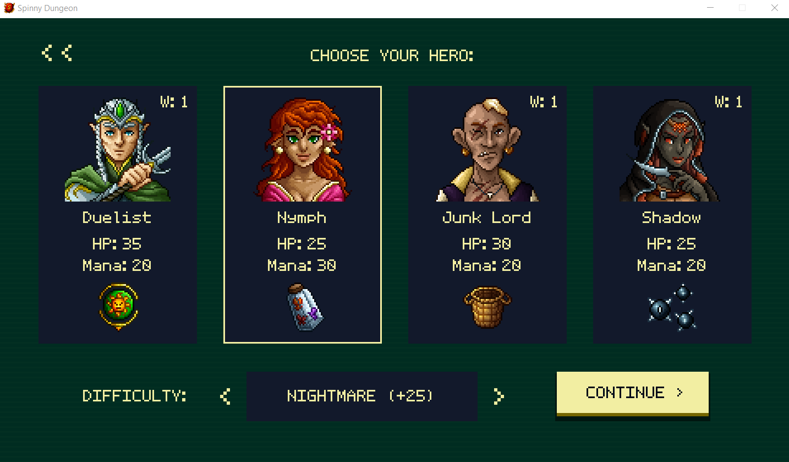
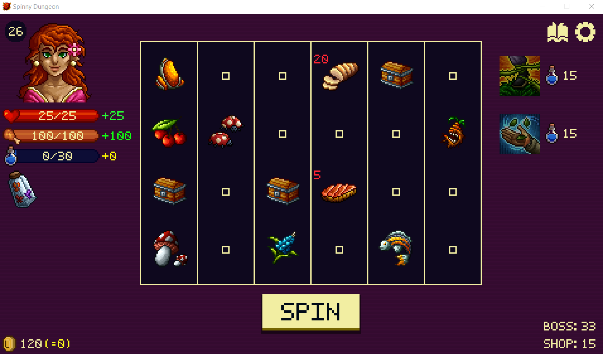
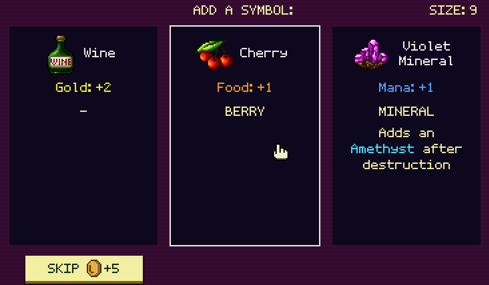
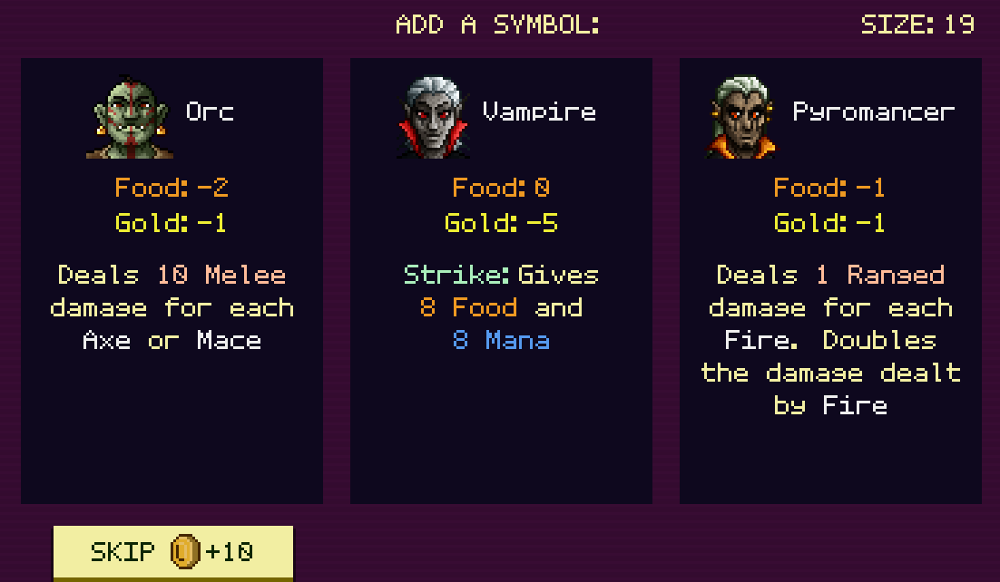
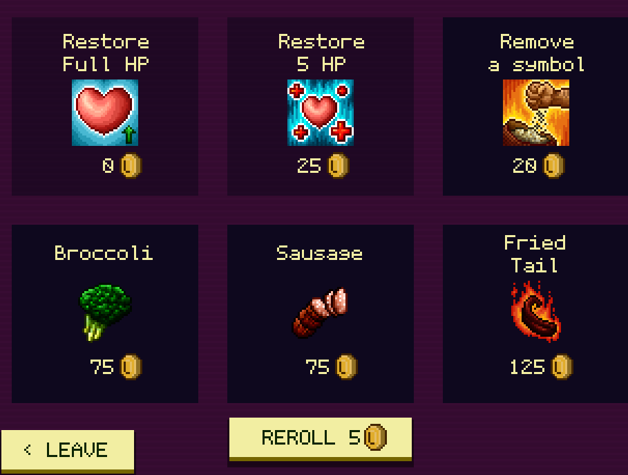

# Spinny Dungeon

## Overview

Spinny Dungeon is a way to play slots without gambling. Instead of matching symbols, you use whatever symbols appear to gain resources and fight monsters. It's a roguelike where you can adjust run difficulty with modifiers. Runs can be anywhere from 5 minutes (if you lose quickly) to about 40 minutes, which is quite fast for the genre.

## Gameplay

In Spinny Dungeon, the story is non-existent! Just keep smashing the Spin button! Choose your character and difficulty level, and go!

The first three turns are to gather resources and add symbols to your "deck". Note that until you get more than the available space, all of your symbols will appear on the slots every turn, so keep that in mind.

There are 4 resource types that you need to balance with your needs:

- Health - If you reach 0, your run is done!
- Food - Each spin costs 10 food. If you don't have enough, it costs Health instead.
- Mana - Use mana to cast spells.
- Gold - Use gold to buy trinkets and other services at the stores. Companions also frequently require payment.

Enemies move one slot to the left each turn. If they are in one of the leftmost two columns, they attack you. Watch out, they get stronger every turn they stay on the leftmost column, so deal with them quickly!

Upon defeating enemies, you can open a chest to add a new symbol to your deck. After some enemies are defeated, you can instead free a prisoner to gain a companion. Beware, while they can be very powerful, companions require "payment" each spin - sometimes food, sometimes money, sometimes mana, or some combination. After defeating a boss, you level up, which lets you learn new spells, upgrade spells, and gain more maximum mana and health.

Pick up trinkets, remove symbols, or heal at the stores. You won't regret your purchase!

That's pretty much it - simple rules, difficult strategy.

## Favorite Parts

- Each character plays differently so it doesn't get boring.
- It's fun collecting all the various items, symbols, and companions.
- There are no microtransactions or gambling with money.
- It's short and I keep coming back to it because it's enjoyable.

## Areas for Improvement

- Some things are not well explained or displayed. For example, it took me hours to realize that the first three spins were different. Additionally, it's hard to tell if some trinkets "work" (they do, it's just a quick animation).
- Balance is an issue. One character is much harder to play than the others, and one is much easier.

## Target Audience

Casual gamers will enjoy the simplicity of the runs along with the variety of playstyles.

Hardcore gamers will likely find this too easy (ok then, up the difficulty with modifiers!).

Ex-gamblers will have a safe refuge here. :smile: :slot_machine: :slot_machine: :slot_machine:

## Summary

This is a game with simple rules and fun interactions. If you want something to spend half an hour on here and there, pick this up! And you might not be able to put it down. Keep spinning!

## Store Link

[Spinny Dungeon on Steam](https://store.steampowered.com/app/2837790/Spinny_Dungeon/)
