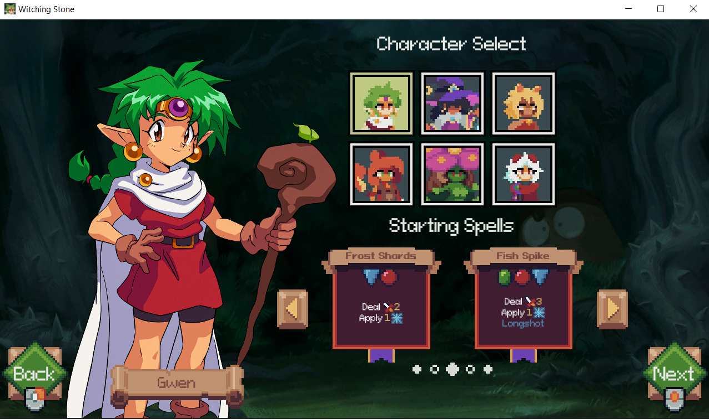
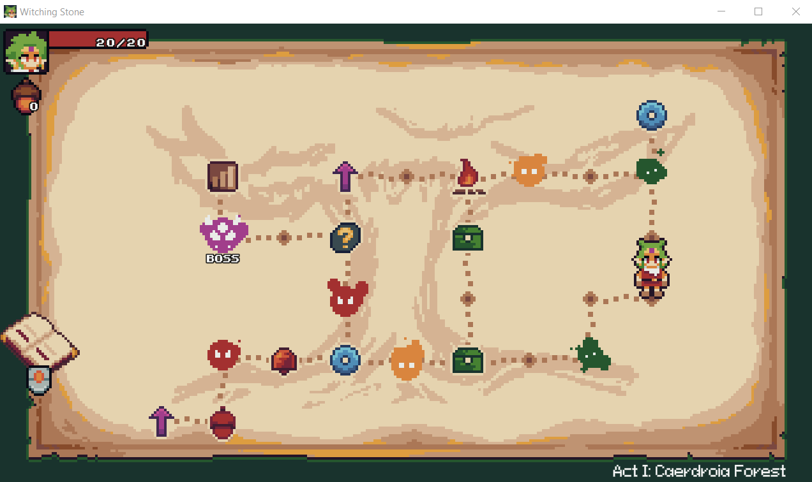
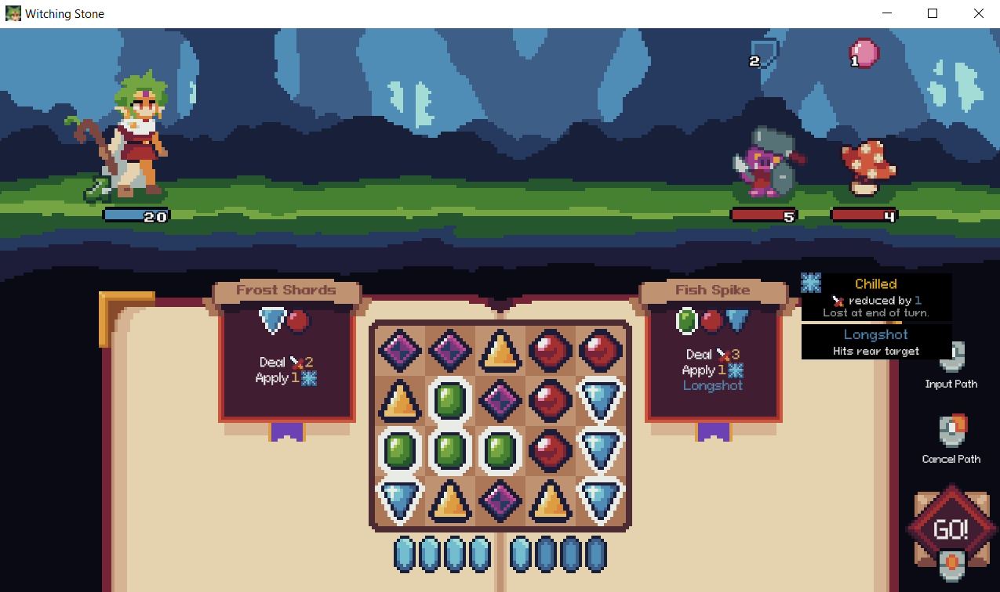
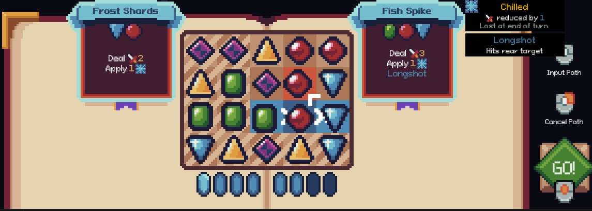
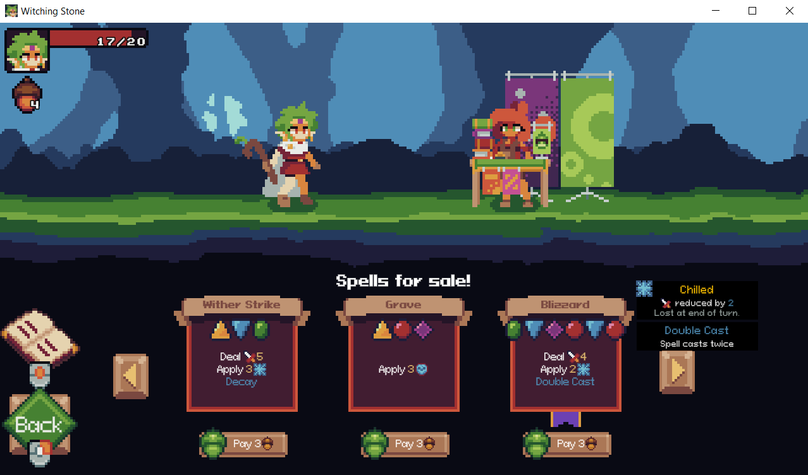
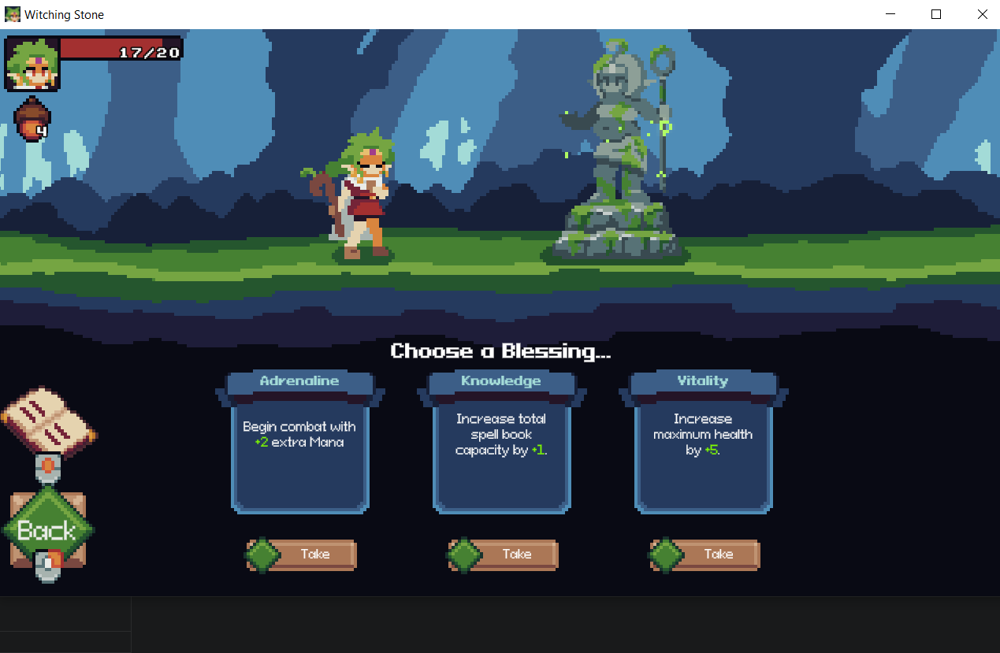

# Witching Stone

## Overview

Witching Stone takes a unique approach to a roguelite. Instead of a deck of cards, you have a selection of spells that you can cast, provided you have the gems required and it's not on cooldown. You get gems by connecting them on a grid. No match-3 here, just select adjacent gems in a sequence.

## Gameplay

Something's corrupting the forest! You have to get to the bottom of it! Journey through multiple levels to discover the source of the corruption.

Choose a character, starting spells, and modifiers.

The map is similar to Slay the Spire except that you can go backwards, which is a nice feature. It allows you to do things like explore more before visiting shops, or save the camp sites for later.

Battles involve connecting gems in sequences to cast spells. You can select adjacent gems up to your amount of energy. You'll start off with some relatively weak spells, but you can find and buy much better spells as you progress.

Check the shop for spells and badges (to modify your spells). Plus there's a squirrel girl!

You'll need to collect blessings in order to get stronger.

What awaits you at the bottom? Victory? Play to find out!

## Favorite Parts

- The art and dialogue are cute.
- There's a squirrel girl.
- It's creative! I like building an engine and making something broken.

## Areas for Improvement

- There is a large element of luck in what appears in the grid each turn, although you can influence it.
- One of the characters is difficult to play.
- Slight balance issue with some spells and badges being really awful.

## Target Audience

Casual gamers will enjoy the characters, gem sequencing, and dialogue. The core gameplay is fun!

Hardcore gamers will likely find this boring or unbalanced.

## Summary

If you like roguelites with turn-based combat and cute characters, you'll enjoy this!

## Store Link

[Witching Stone on Steam](https://store.steampowered.com/app/2693530/Witching_Stone/)
